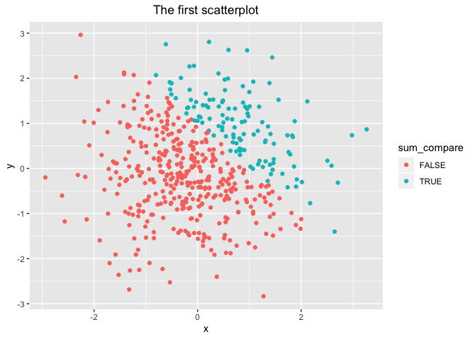

p8105\_hw1\_xj2249
================
jx2249
2019/9/12

# Problem 1

## Create a data frame

``` r
library(tidyverse)
p1_df <- tibble(
                rnorm_sample = rnorm(8), 
                sample_pos = rnorm_sample > 0,
                character_vec = c(rep(c("dog","cat"),4)), 
                factor_vec = factor(c("a","b","c","a","b","c","a","b"))
                )
               
sapply(p1_df, mean)
```

    ## Warning in mean.default(X[[i]], ...): argument is not numeric or logical:
    ## returning NA
    
    ## Warning in mean.default(X[[i]], ...): argument is not numeric or logical:
    ## returning NA

    ##  rnorm_sample    sample_pos character_vec    factor_vec 
    ##    -0.3120196     0.5000000            NA            NA

It works to take the mean of the random sample and the logical variable,
but it doesn’t when it comes to the character and the factor
variable.

## Apply the “as.numeric function”

``` r
# convert the logical vector to numeric, and multiply the random sample by the result
as.numeric(pull(p1_df, sample_pos ))
# convert the logical vector to a factor, and multiply the random sample by the result
as.numeric(pull(p1_df, character_vec ))
# convert the logical vector to a factor and then convert the result to numeric, and multiply the random sample by the result
as.numeric(pull(p1_df, factor_vec ))
```

As the result shows, the logical variable is able to be converted into
numbers(1 or 0).  
The character variable and the factor variables are not allowed since in
my case, they are neither numeric nor logical value, which explains why
means can’t be taken
    above.

## We’re converting variables \!

``` r
as.numeric(pull(p1_df, sample_pos )) * pull(p1_df, rnorm_sample )
```

    ## [1] 0.00000000 0.00000000 1.34086998 0.00000000 0.00000000 0.01309222
    ## [7] 1.15192030 0.08128490

``` r
as.factor(pull(p1_df, sample_pos )) * pull(p1_df, rnorm_sample )
```

    ## Warning in Ops.factor(as.factor(pull(p1_df, sample_pos)), pull(p1_df,
    ## rnorm_sample)): '*' not meaningful for factors

    ## [1] NA NA NA NA NA NA NA NA

``` r
as.numeric(as.factor(pull(p1_df, sample_pos ))) * pull(p1_df, rnorm_sample )
```

    ## [1] -1.13726918 -1.47108259  2.68173995 -0.56059631 -1.91437593  0.02618444
    ## [7]  2.30384061  0.16256980

# Problem 2

## Create a new data frame

``` r
p2_df <- tibble(
                x = rnorm(500), 
                y = rnorm(500),
                sum_compare = (x + y) > 1, 
                numeric_sum = as.numeric(sum_compare),
                factor_sum = as.factor(sum_compare)
                )
```

  - The size of the dataset is 500 and 500
  - The mean, median, and standard deviation of x are -0.0249642,
    -0.071283 and 0.9822064
  - The proportion of cases for which x + y \> 1 is 0.244

## Make scatterplots of y vs x

``` r
library(ggplot2)
plot1 <- 
        p2_df %>% 
        ggplot(aes(x = x, y = y, color = sum_compare)) + 
        geom_point() + 
        labs(title = "The first scatterplot") + 
        theme(plot.title = element_text(hjust = 0.5))
        
plot1 
```

<!-- -->

``` r
plot2 <- p2_df %>% 
         ggplot(aes(x = x, y = y, color = numeric_sum)) + 
         geom_point() + 
         labs(title = "The second scatterplot") + 
         theme(plot.title = element_text(hjust = 0.5))
plot2 
```

<!-- -->

``` r
plot3 <- p2_df %>% 
         ggplot(aes(x = x, y = y, color = factor_sum)) + 
         geom_point() + 
         labs(title = "The third scatterplot") +
         theme(plot.title = element_text(hjust = 0.5))
plot3 
```

<!-- -->

``` r
# Export the first scatterplot to project directory using ggsave.
ggsave("plot1.png",plot1)
```

In plot2 and plot3, the `color = ...` inside of `aes()` are respectively
numeric and factor variables, which correspond to gradient and discrete
color scale, though in this case, the plot2 also shows only two colors.(
Because only two value 0 or 1 can be taken).
